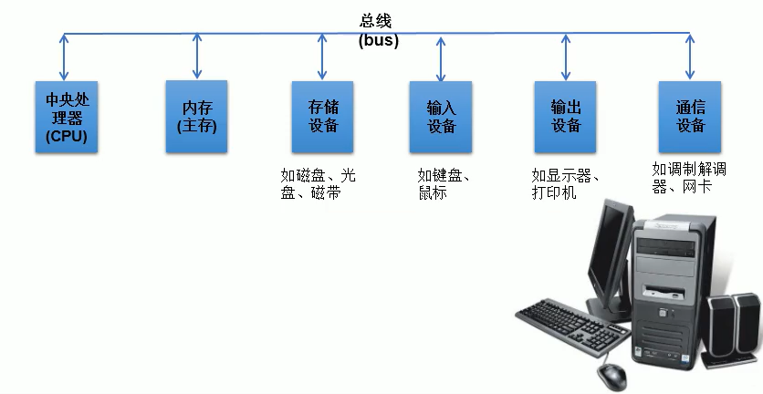
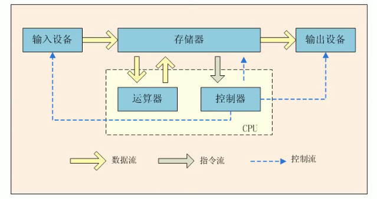
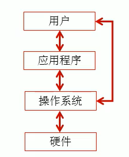
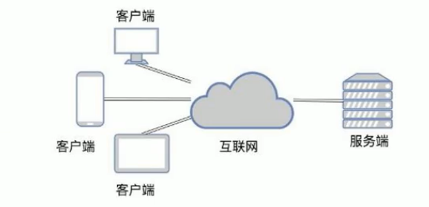
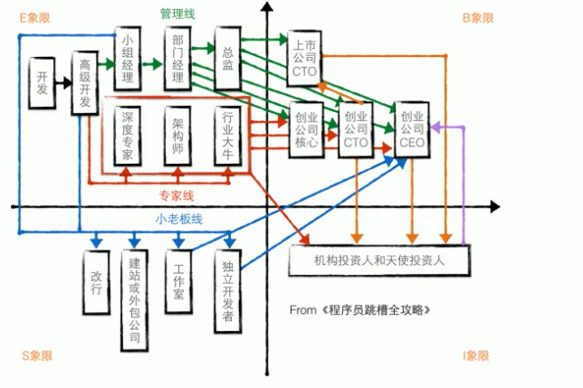
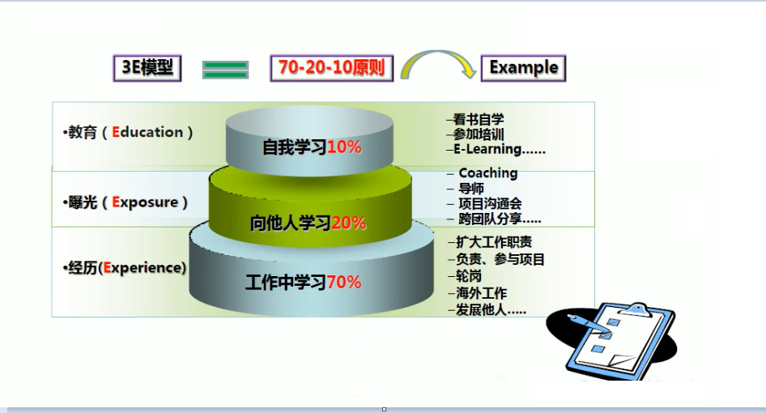

[TOC]

# 编程入门

## 1. 概述

计算机包括硬件(hardware)和软件(software)两部分。硬件包括计算机中可以看得见的部分。而软件提供看不见的指令。这些指令控制硬件并且使得硬件完成特定的任务。

### 程序设计

**定义：**创建（或开发）软件。软件包含了指令，高速计算机做什么。

**应用场景：**软件遍布我们周围。除了个人计算机，飞机、汽车、手机甚至烤面包机中，同样运行着软件。

### 程序设计语言

软件开发人员在称为程序设计语言的强大工具的帮助下创建软件。

### 如何选择该学习哪种程序设计语言？

- 程序设计语言有很多种，每种语言都是为了实现某个特定的目的而发明的。
- 你会困惑哪种语言是最好的。事实上，没有“最好”的语言。每种语言都有它的长处和短处。
- 经验丰富的程序员知道各种语言擅长的场景，因此，会尽可能的掌握各种不同的程序设计语言。
- 如果你掌握了一种编程语言，应该会更容易上手其它的编程语言。关键是学习如何使用程序设计方法来解决问题。

## 2. 计算机硬件介绍

冯·诺依曼体系结构是现代计算机的基础，现在大多计算机仍是冯·诺依曼计算机的组织结构，只是做了一些改进而已，并没有从根本上突破冯·诺依曼体系结构的束缚。冯·诺依曼也因此被人们称为”计算机之父“。

### 中央处理器

- 中央处理器(Central Processing Unit, CPU)是计算机的大脑。它从内存中获取指令，然后执行这些指令。

- 包括：控制单元(control unit)和算术/逻辑单元(arithmetic/longin unit)。

  控制单元：用于控制和协调其他组件的动作。
  算术/逻辑单元:用于完成数值的运算(+、-、*、/)和逻辑运算(比较)。

- 每台计算机都有一个内部时钟，该时钟以固定速度发射电子脉冲。时钟速度越快，在给定的时间段内执行的指令就越多。速度的计量单位是赫兹(Hz)，1Hz相当于每秒个脉冲。随着CPU速度不断提高，目前以千兆赫(GHz)来表示。
- 最初的一个CPU只有一个核(core)。核是处理器中实现指令读取和执行的部分。一个多核CPU是一个具有两个或者多个更多独立核的组件。可提高CPU的处理能力。
- 现在的 CPU 都是构建在一块小小的硅半导体芯片上，这块芯片上包含数百万称为晶体管的小电路开关上，用于处理信息。

### IT 定律之计算机行业发展规律

- 摩尔定律(Moore's Law)

  > 摩尔定律是由英特尔（Intel）创始人之一戈登摩尔（Gordon Moore）提出来的。其内容为：当价格不变时，集成电路上可容纳的元器件的数目，约每隔 18~24 个月便会增加一倍，性能也将提升一倍。换言之，每一美元所能买到的电脑性能，将每隔 18~24 个月翻一倍以上。

- 安迪-比尔定律(Andy and Bill's Law)

  > 安迪-比尔定律(Andy and Bill's Law )描述了硬件产商和软件产商之间的关系。即比尔要拿走安迪所给的(What Andy gives,Bill takes away )。
  >
  > 个人电脑工业整个的生态链是这样的：以微软为首的软件开发商吃掉硬件提升带来的全部好处，迫使用户的更新机器让惠普和戴尔等公司的收益，而这些整机生产厂再向英特尔这样的半导体厂订货购买新的芯片、同时向Seagate等外设厂购买新的外设。在这中间，各家的利润先后得到相应的提升，股票也随着增长。各个硬件半导体个外设公司在将利润投入研发，按照摩尔定理制定的速度，提升硬件性能，为微软下一步的更新软件、吃掉硬件性能做准备。当然，微软和其他软件开发商在吃掉大部分硬件提升好处的同时，或多或少的会给用户带来一些新东西。

- 反摩尔定律(Reverse Moore's Law)

  > Google的前CEO埃里克史密特提出的：如果你反过来看摩尔定律，一个IT公司如果今天和18个月前卖掉同样多的、同样的产品，它的营业额就要降一半。IT界把它称为反摩尔定律。反摩尔定律对于所有的IT公司来讲，都是非常可怕的，因为一个IT公司花了同样的劳动，却只得到以前一半的收入。反摩尔定律逼着所有的硬件设备公司必须赶上摩尔定律所规定的更新速度，而所有的硬件和设备生产厂活得都是非常辛苦的。

### 存储设备

+ 内存中的信息在断电时会丢失。那么我们可以考虑将程序和数据永久的保存在存储设备上。当计算机确实需要这些数据时，再移入内存，因为从内存中读取比存储设备读取要快得多。

+ 存储

  > 磁盘驱动器
  >
  > 1. 每台计算机至少有一个硬盘驱动器。硬盘(hard disk)
  >
  > 2. 用于永久的保存数据和程序。

+ 存储设备

  > 光盘驱动器(CD和DVD)
  >
  > CD的容量可达700MB。
  >
  > DVD的容量可达4.7GB。
  >
  > USB闪存驱动器
  >
  > USB：Universal Senrial Bus,通用于串行总线。
  >
  > 可以使用USB将打印机、数码相机、鼠标、外部硬盘驱动器连接到计算机上。
  >
  > USB闪存驱动器很小，可用于存储和传输数据的设备。

### 内存

比特(bit)和字节(byte)

+ 在讨论内存前，先清楚数据是如何存储在计算机中的。

+ 计算机就是一系列的电路开关。每隔开关存在两种状态：关(off)和(on)。如果电路是开的，它的值是1。如果电路是关的，它的值是0.

+ 一个0或者一个1存储为一个比特(bit),是计算机中最小的存储单位。

+ 计算机中是最基本的存储单元是字节(byte)。每个字节由8个比特构成。

+ 计算机的存储能力是以字节和多字节来衡量的。如下：

  > 千字节(kilobyte,KB)=1024B
  >
  > 兆字节(megabyte,MB)=1024KB
  >
  > 千兆字节(gigabyte,GB)=1024MB
  >
  > 万亿兆字节(terabyte,TB)=1024GB。

+ 内存(也叫Random-Access Memory,RAM)：由一个有序的字节系列组成，用于存储程序及程序需要的数据。

+ 一个程序和它的数据在被CPU执行前必须移到计算机的内存中。

+ 每个字节都有一个唯一的地址。使用这个地址确定字节的位置，以便于存储和获取数据。

+ 一个计算机具有的RAM越多，它的运行速度越快，但是此规律是有限制的。

+ 内存与CPU一样，也构建在表面嵌有数百万晶体管的硅半导体芯片上。但内存芯片更简单、更低速、更便宜。

+ 实测发现：内存存取数据的速度比硬盘的存取速度快10倍，在某些环境里，硬盘和内存之间的速度差距可能会更大。而CPU的速度比内存不知还要快多少倍。当我们把程序从硬盘放到内存以后，CPU就直接在内存运行程序，这样比CPU直接在硬盘运行程序就要快很多。

+ 内存解决了一部分CPU运行过快，而硬盘数据存储太慢的问题。提高了我们的电脑运行速度。内存就如同一条"高速车道"一般，数据由传输速度较慢的硬盘通过这条高速车道传送至CPU进行处理！

+ 但内存是带电存储的(一单断电数据就会消失)，而且容量有限，所以要很长时间存储程序或数据就需要使用硬盘。

+ 内存在这里起来两个作用：

  > 1.保存从硬盘读取的数据，提供给CPU使用
  >
  > 2.保存CPU的一些临时执行结果，以便CPU下次使用或保存到硬盘。

### 输入和输出设备

+ 常见的输入设备：键盘(keyboard)和鼠标(mouse)

+ 常见的输出设备：显示器(monitor)和打印机(printer)

+ 显示器屏幕分辨率：是指显示设备水平和垂直方向上显示的像素(PX)数。

  > 分辨率可以手工设置。
  >
  > 分辨率越高，图像越锐化、越清晰。

### 通信设备

+ 计算机可以通过通信设备进行联网。

+ 常见的设备有：

  > 拨号调制解调器：使用的是电话线，传输速度可达56 000bps(bps:每秒比特)
  >
  > DSL(数字用户线)：使用的也是电话线，但传输速度叫上面的快20倍
  >
  > 电缆调制解调器：利用有线电视电缆进行数据传输，通常速度比DSL快。
  >
  > 网络接口卡(NIC)：将计算机接入局域网(LAN)的设备。局域网通常用于大学、商业组织和政府组织。速度甚至可达1000Mbps
  >
  > 无线网络：在家庭、商业和学校中及其常见。计算机可通过无线适配器连接到局域网或internet上。

## 3. 计算机发展史上的鼻祖

### 阿兰·图灵

+ 最近半个世纪以来，世界计算机科学界的重大进步，离不开图灵等人的理论奠基作用和多方面的开场性研究成果。图灵是当之无愧的计算机科学和人工智能之父。甚至认为，他在技术上的贡献以及对未来世界的影响几乎可与牛顿、爱因斯坦等巨人比肩。
+ 图灵论文中的"用有限的指令和有限的存储空间可算尽一切可算之物"理论让当时所有的科学家震惊。
+ 美国计算机协会(ACM)的年度"图灵奖"，自从1966年设立以来，一直是世界计算机科学领域的最高荣誉，相当于计算机科学界的诺贝尔奖。至今，中国人只有姚期智院士获该奖项。

### 冯·诺依曼

+ 20世纪最重要的数学家之一，在现代计算机、博弈论、核武器和生化武器等诸多领域内有杰出建树的最伟大的科学全才之一，被后人称为"计算机之父"和"博弈论之父"。
+ 计算机基本工作原理是存储程序和程序控制，它是由 世界著名数学家冯·诺依曼提出的。最简单的来说，冯·理论的要点是：数字计算机的数采用二进制；计算机应该按照顺序执行。
+ 同样有着"计算机之父“称号的冯·的助手弗兰克尔在一封信中写道："......计算机的基本概念属于图灵。按照我的看法，冯·诺依曼的基本作用是使世界认识了有图灵引入的计算机的基本概念......"

---

**根据冯·诺依曼体系结构构成的计算机，必须具有如下功能：**

- 把需要的程序和数据送至计算机中。
- 必须具有长期记忆程序、数据、中间结果及最终运算结果的能力。
- 能够完成各种算术、逻辑运算和数据传送等数据加工处理的能力。
- 能够根据需要控制程序走向，并能够根据指令控制机器的各部件协调操作。
- 能够按照要求将处理结果输出给用户。

## 4. 操作系统

- 操作系统(Operating System)是运行在计算机上的最重要的程序，它可以管理和控制计算机的活动。

- 硬件、操作系统、应用程序和用户之间的关系如下图所示：

  

+ 操作系统的主要任务：
  + 控制和监视系统的活动
  + 分配和调配系统资源
  + 调度操作

## 5. 万维网

万维网(World Wide Web,www,环球信息网)常简称为Web，发明者蒂姆·伯纳斯·；李。分为Web客户端和Web服务器程序。WWW可以让Web客户端(常用浏览器)访问浏览Web服务器上的页面。是一个由许多互相链接的超文本组成的系统，通过互联网访问。在这个系统中，每个有用的事物，称为一样"资源"：并且由一个全局"统一资源标识符"（URl)标识：这些资源通过超文本传输协议（Hypertext Transfer Protocol)传送给用户，而后者通过点击链接来获得资源。

万维网是无数个网络站点和网页的集合，它们在一起构成了因特网最主要的部分（因特网也包括电子邮件、Usenet以及新闻组）。它实际上是多媒体的集合，是由超级链接连接而成的。我们通常通过网络浏览器上网观看的，就是万维网的内容。

## 6. 职业发展与提升

## 7. 学习经验探讨

- 锻炼“双核”处理，边听边思考，边做“笔记”

- 纸上得来终觉浅，觉知此事要躬行！

  > 第一层次：看得懂(依赖于视频、书、帖子)
  >
  > 第二层次：练得熟（每天代码必须实现2-3遍）
  >
  > 总结：三分看，七分练